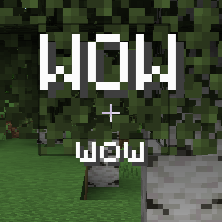
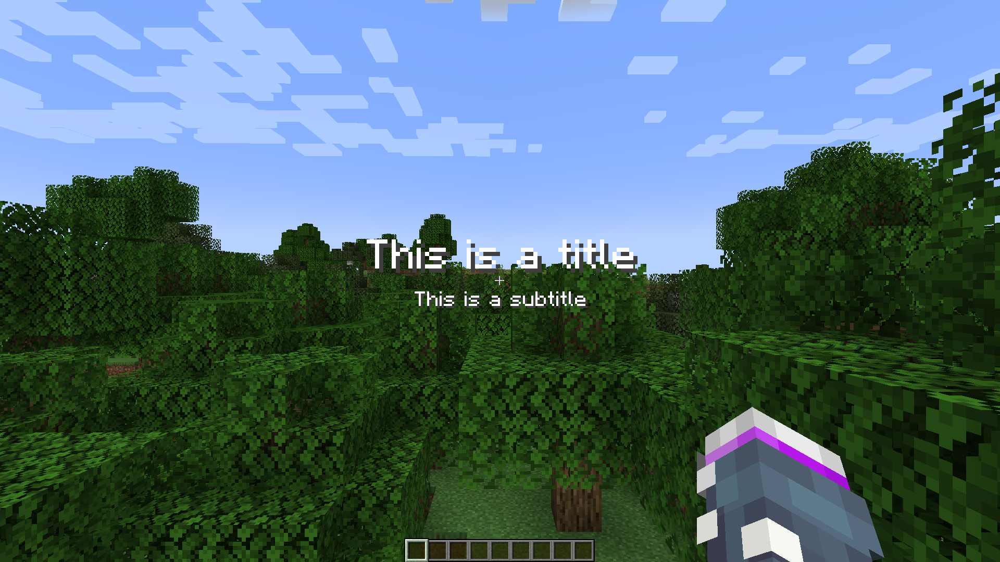
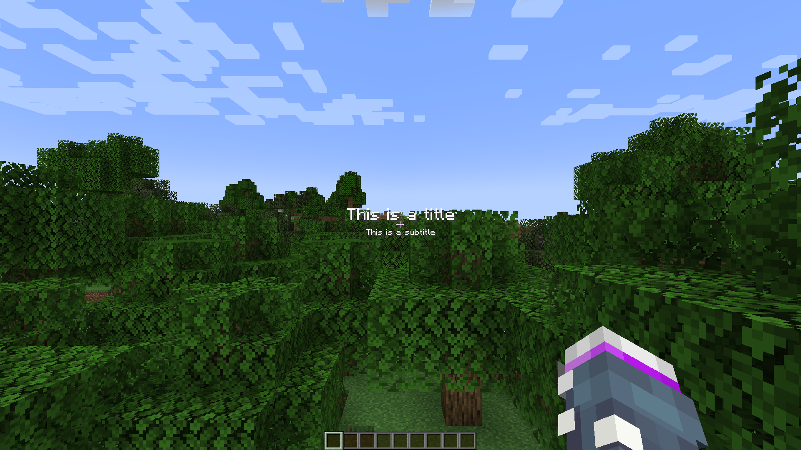

# Title Resizer

Ever get annoyed that Minecraft's titles go offscreen? Now you can shrink them to whatever size you want!

## Default Title Size at 1080p, GUI Scale 2:

## Title Size 0.5 at 1080p, GUI Scale 2:

## How to use
This is a Fabric mod that requires [Cloth Config](https://modrinth.com/mod/cloth-config). If you install [Mod Menu](https://modrinth.com/mod/modmenu), you can also edit the config in-game.